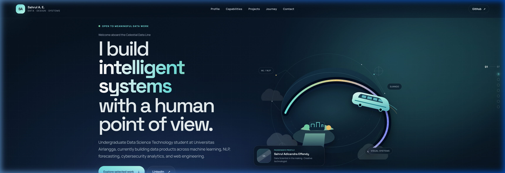
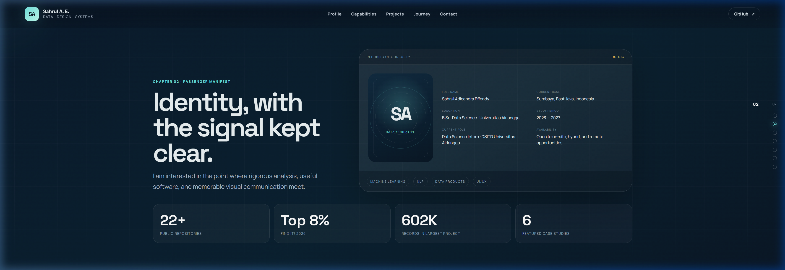
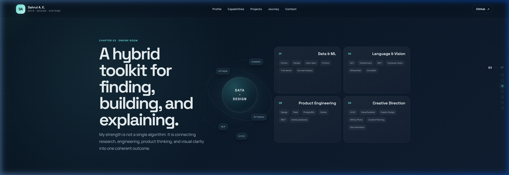
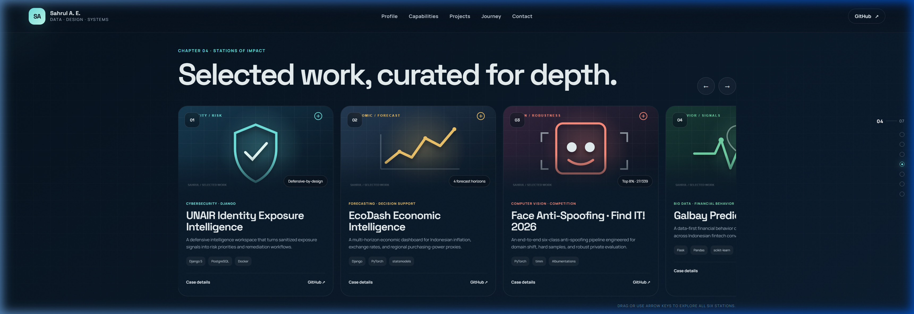

# Sahrul Adicandra Effendy — Personal Portfolio Website


A personal portfolio website to showcase my background, skills, work experience, achievements, and projects. Built with **Django 5.2** and vanilla HTML/CSS/JavaScript, featuring a fully responsive design with smooth scroll navigation, a working contact form, and Docker support for easy deployment.

## Screenshots

| Hero | Profile |
|------|---------|
|  |  |

| Skills | Projects |
|--------|----------|
|  |  |

## Features

- Smooth full-screen scroll navigation across multiple sections
- Profile, skills, experience, achievements, and project showcase
- Horizontal project carousel with drag support, keyboard access, and detail dialogs
- Contact form with CSRF protection, server-side validation, honeypot anti-spam, and Django Admin review
- Responsive layout for both desktop and mobile
- Keyboard navigation and reduced-motion accessibility support
- WhiteNoise for static file delivery
- Gunicorn-ready for production deployment
- Docker and Docker Compose setup included
- Automated Django tests

## Getting Started

### Windows

Double-click `run_portfolio.bat`, or run manually:

```powershell
python -m venv .venv
.venv\Scripts\activate
python -m pip install -r requirements.txt
python manage.py migrate
python manage.py runserver
```

Open [http://127.0.0.1:8000](http://127.0.0.1:8000).

### macOS / Linux

```bash
./run_portfolio.sh
```

Or manually:

```bash
python3 -m venv .venv
source .venv/bin/activate
pip install -r requirements.txt
python manage.py migrate
python manage.py runserver
```

Open [http://127.0.0.1:8000](http://127.0.0.1:8000).

### Docker

```bash
docker compose up --build
```

Open [http://127.0.0.1:8000](http://127.0.0.1:8000).

## Admin Panel

Create a superuser to review contact form submissions:

```bash
python manage.py createsuperuser
```

Access the admin panel at [http://127.0.0.1:8000/admin/](http://127.0.0.1:8000/admin/).

## Project Structure

Portfolio content is centralized in:

```
portfolio/data.py
```

Main template and asset files:

```
portfolio/templates/portfolio/home.html
portfolio/static/portfolio/css/style.css
portfolio/static/portfolio/js/main.js
portfolio/static/portfolio/img/
```

## Production Deployment

1. Copy `.env.example` to `.env` and fill in the required values.
2. Set a secure `DJANGO_SECRET_KEY`.
3. Set `DJANGO_DEBUG=False`.
4. Set `DJANGO_ALLOWED_HOSTS` to your domain.
5. Run `python manage.py migrate` and `python manage.py collectstatic --noinput`.
6. Serve with Gunicorn or use the provided Docker image.

## Running Tests

```bash
python manage.py test
```

## License

This project is licensed under the [MIT License](LICENSE).
