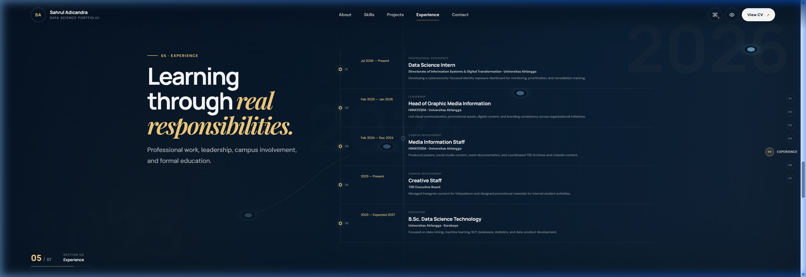
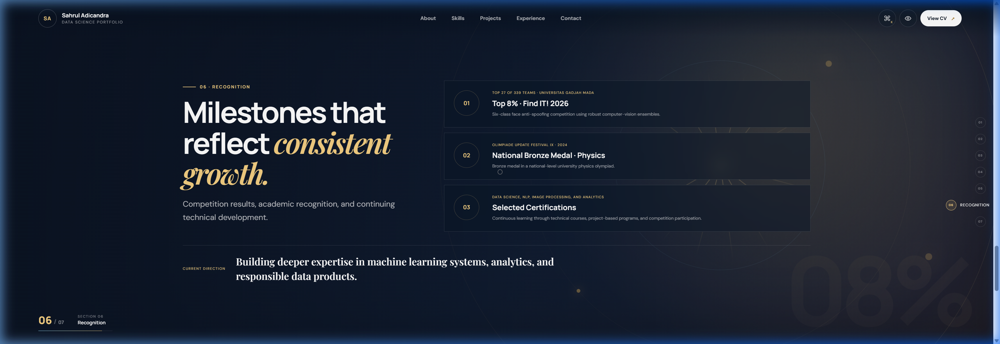
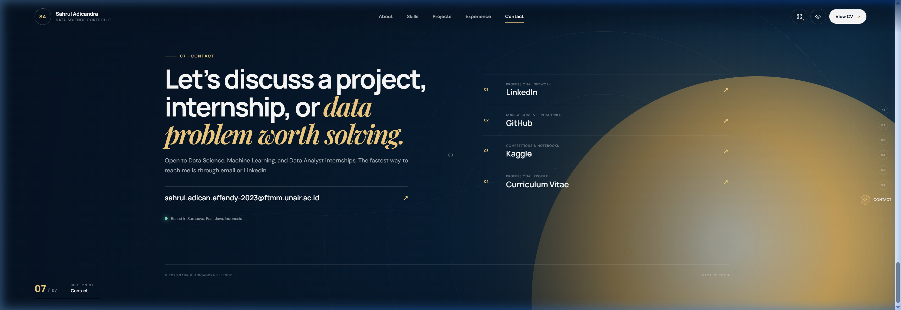

# Sahrul Adicandra Effendy — Data Science Portfolio


A professional, data-centric personal portfolio website showcasing expertise in Machine Learning, Natural Language Processing, Data Products, and Analytics. Developed with **Django 5.2**, vanilla frontend design patterns, and an interactive procedural WebGL 3D world engine.

---

## Screenshots

| 01. Overview (Hero) | 02. About (Profile) |
|---|---|
|  |  |

| 03. Skills | 04. Selected Projects |
|---|---|
|  |  |

| 05. Experience | 06. Recognition (Achievements) |
|---|---|
|  |  |

| 07. Contact | |
|---|---|
|  | |

---

## Key Features

- **7-Section Cinematic Navigation**: Smooth scroll-snapped layout covering Overview, About, Skills, Projects, Experience, Achievements, and Contact.
- **Interactive 3D WebGL Background**: A custom procedural world engine rendering clouds, floating islands, and celestial orbits in real-time.
- **Comprehensive Profiles & Stats**: Integrated bio details, credentials, resume download link, and key career metrics.
- **Interactive Projects Showcase**: A customizable horizontal project carousel with custom case details and external repository links.
- **Secure Contact Form**: Fully functional contact form with CSRF validation, server-side data sanitization, honey-pot spam protection, and SQLite integration.
- **Administration Panel**: Django Admin panel configured for reviewing received contact submissions.
- **Cross-Platform Accessibility**: Built-in support for keyboard controls, reduced-motion preferences, and screen-readers.
- **Production-Ready Core**: WhiteNoise static file delivery, Gunicorn deployment configurations, and Docker/Docker Compose containers.

---

## Getting Started

### Windows

Double-click `run_portfolio.bat` or run manually in PowerShell:

```powershell
python -m venv .venv
.venv\Scripts\activate
python -m pip install -r requirements.txt
python manage.py migrate
python manage.py runserver
```

Open [http://127.0.0.1:8000](http://127.0.0.1:8000).

### macOS / Linux

```bash
./run_portfolio.sh
```

Or manually:

```bash
python3 -m venv .venv
source .venv/bin/activate
pip install -r requirements.txt
python manage.py migrate
python manage.py runserver
```

Open [http://127.0.0.1:8000](http://127.0.0.1:8000).

### Docker Containerization

```bash
docker compose up --build
```

Open [http://127.0.0.1:8000](http://127.0.0.1:8000).

---

## Admin Panel

Create a superuser to access the contact database panel:

```bash
python manage.py createsuperuser
```

Access the panel at [http://127.0.0.1:8000/admin/](http://127.0.0.1:8000/admin/).

---

## Project Structure

All portfolio text, metrics, and project contents are centralized in:
- [data.py](file:///c:/Users/adief/OneDrive/Dokumen/Project/Website%20Portofolio/portfolio/data.py) — Modify this file to update your projects, skills, or job experience.

Main template and visual assets:
- [home.html](file:///c:/Users/adief/OneDrive/Dokumen/Project/Website%20Portofolio/portfolio/templates/portfolio/home.html) — Main page structure.
- [style.css](file:///c:/Users/adief/OneDrive/Dokumen/Project/Website%20Portofolio/portfolio/static/portfolio/css/style.css) — Custom responsive styling and animations.
- [main.js](file:///c:/Users/adief/OneDrive/Dokumen/Project/Website%20Portofolio/portfolio/static/portfolio/js/main.js) — Interface event handlers and transitions.
- [world-engine.js](file:///c:/Users/adief/OneDrive/Dokumen/Project/Website%20Portofolio/portfolio/static/portfolio/js/world-engine.js) — Custom WebGL background engine.

---

## Production Deployment Checklist

1. Copy `.env.example` to `.env` and fill in active keys.
2. Replace `DJANGO_SECRET_KEY` with a strong random string.
3. Configure `DJANGO_DEBUG=False`.
4. Add your domain name to `DJANGO_ALLOWED_HOSTS`.
5. Execute migrations and collect static files: `python manage.py migrate` and `python manage.py collectstatic --noinput`.

---

## Running Verification Tests

```bash
python manage.py test
```

---

## License

This project is licensed under the [MIT License](LICENSE).
